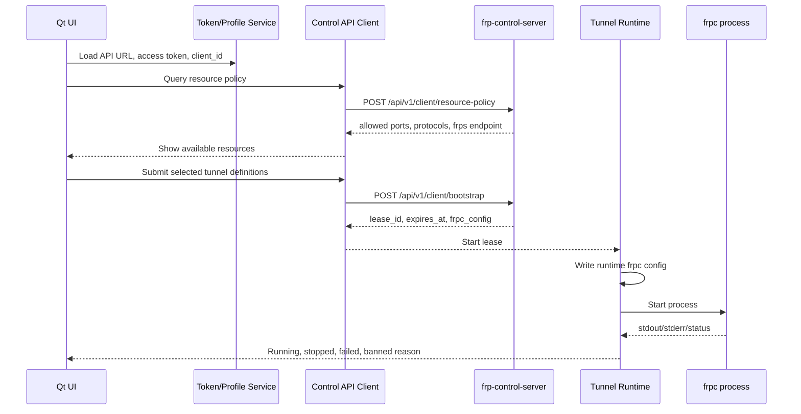

# Client Architecture

## Goals

The client should be small, predictable, and hard to misuse. The server remains the source of truth for identity, port ranges, allowed protocols, runtime frp tokens, bans, and DPI policy. The client only asks for permission, lets the user choose inside the allowed bounds, then runs the exact frpc config returned by the server.

## Runtime Flow



## Modules

### 1. Presentation

Qt Widgets pages:

- Setup page: API base URL, HTTPS API token, test connection.
- Resource page: allowed port range, max port count, allowed protocols, frps endpoint.
- Tunnel editor: local IP, local port, protocol, selected remote port, proxy name.
- Runtime page: start/stop, current lease, frpc logs, copied config.
- Settings page: client id, frpc path, runtime directory, auto-start preference.

The UI should not allow ports or protocols outside the latest server policy. Validation happens both in the UI and on the server.

### 2. Profile Service

Owns local client state:

- `api_base_url`
- `access_token`
- `client_id`
- `frpc_path`
- optional UI preferences

Initial version can store JSON under the user app data directory. Later, the token should move to platform secure storage, such as Windows Credential Manager.

### 3. Control API Client

Wraps all server API calls:

- `queryResourcePolicy(accessToken, clientID)`
- `bootstrap(accessToken, clientID, clientVersion, proxies)`

Responsibilities:

- always send JSON;
- parse normal and rejected responses;
- surface ban reasons clearly;
- apply request timeout and TLS errors;
- keep API DTOs separate from UI models.

### 4. Policy Model

Local representation of server policy:

- port start/end;
- max port count;
- allowed protocols;
- frps server address;
- frps server port;
- frp transport TLS flag.
- DPI enabled state;
- DPI blocked traffic types.

This module should answer questions like:

- Is this protocol allowed?
- Is this remote port inside range?
- Does this tunnel set exceed max port count?

### 5. Tunnel Model

User-defined tunnel draft:

- name;
- protocol: first `tcp` and `udp`;
- local IP;
- local port;
- remote port.

HTTP/HTTPS domain tunnels can be added later after the server-side user-selected flow is expanded beyond TCP/UDP ports.

### 6. Runtime Service

Owns active leases and frpc process lifecycle:

- writes returned `frpc_config` to a runtime file;
- starts `frpc` through `QProcess`;
- captures stdout/stderr;
- stops/restarts process;
- reports exit codes and errors;
- cleans old runtime files.

The runtime service should not generate frpc configs itself in normal mode. It should run the server-returned config, because that config contains the temporary frp runtime token accepted by frps.

### 7. frpc Locator

Finds the frpc binary:

- user-selected path;
- bundled path if we later package one;
- development path such as `D:/Qt_test/frp_0.69.1_windows_amd64/frpc.exe`.

Do not download frpc at runtime in the first version. Local packaging is easier to explain to antivirus software and easier to debug.

### 8. Event Bus

Small internal signal layer using Qt signals/slots:

- profile changed;
- resource policy loaded;
- bootstrap rejected;
- lease started;
- frpc log line received;
- frpc exited.

This keeps UI pages from directly controlling process and network details.

## Suggested Class Sketch

```text
AppController
  - owns ProfileService, ControlApiClient, TunnelRuntimeService
  - coordinates UI actions

ProfileService
  - load()
  - save()
  - ensureClientId()

ControlApiClient
  - queryResourcePolicy(...)
  - bootstrap(...)

PolicyValidator
  - validateTunnelDrafts(policy, drafts)

TunnelRuntimeService
  - startLease(bootstrapResult)
  - stop()
  - status()

FrpcProcess
  - start(configPath)
  - stop()
  - signals: logLine, exited, failed
```

## API Contracts

### Query Resource Policy

Request:

```json
{
  "access_token": "ak_xxx",
  "client_id": "device-001"
}
```

Expected success response:

```json
{
  "ok": true,
  "user": "alice",
  "token": "HTTPS API Token",
  "policy": {
    "user_id": 2,
    "port_start": 6001,
    "port_end": 6010,
    "max_ports": 2,
    "allowed_protocols": ["tcp", "udp"],
    "enabled": true
  },
  "dpi": {
    "enabled": true,
    "mode": "block",
    "enabled_detectors": ["http", "tls", "quic", "encrypted_tunnel"],
    "blocked_traffic_types": ["quic", "encrypted_tunnel"],
    "allowed_traffic_types": ["http", "tls"],
    "block_on_any_finding": false
  },
  "frp_server_addr": "127.0.0.1",
  "frp_server_port": 7000,
  "frp_transport_tls": false
}
```

Rejected response:

```json
{
  "ok": false,
  "status": "banned",
  "reason": "banned by administrator"
}
```

### Bootstrap

Request:

```json
{
  "access_token": "ak_xxx",
  "client_id": "device-001",
  "client_version": "0.1.0",
  "proxies": [
    {
      "name": "ssh",
      "type": "tcp",
      "local_ip": "127.0.0.1",
      "local_port": 22,
      "remote_port": 6001
    }
  ]
}
```

Expected success response:

```json
{
  "ok": true,
  "lease_id": "lease_xxx",
  "expires_at": "2026-07-06T15:00:00+08:00",
  "expires_in": 3600,
  "frpc_config": "serverAddr = ..."
}
```

## State Machine

```text
NotConfigured
  -> ReadyToQuery
  -> PolicyLoaded
  -> BootstrapReady
  -> Running
  -> Stopping
  -> Stopped

Any state
  -> Rejected
  -> NetworkError
  -> FrpcMissing
  -> FrpcCrashed
```

## DPI and Blocking Hooks

The client does not implement DPI. DPI is server-side. The client only needs to display server responses:

- current DPI state returned by `resource-policy`;
- traffic types currently blocked by DPI;
- bootstrap rejected reason;
- user banned reason;
- token banned reason;
- client banned reason;
- frpc process disconnected.

Later, if the server exposes DPI event summaries for users, the client can add a read-only event page. That should be a separate API and UI module, not mixed into the runtime process controller.

## Implementation Order

1. Create Qt/CMake skeleton.
2. Implement ProfileService and settings file.
3. Implement ControlApiClient with resource-policy and bootstrap.
4. Build the first UI pages.
5. Implement frpc path selection and process start/stop.
6. Add log panel and status state machine.
7. Add packaging after the flow works locally.
